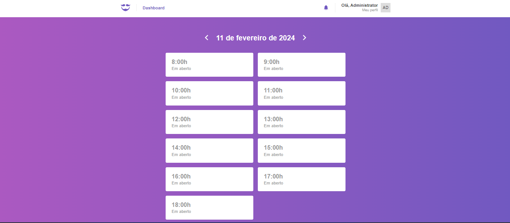
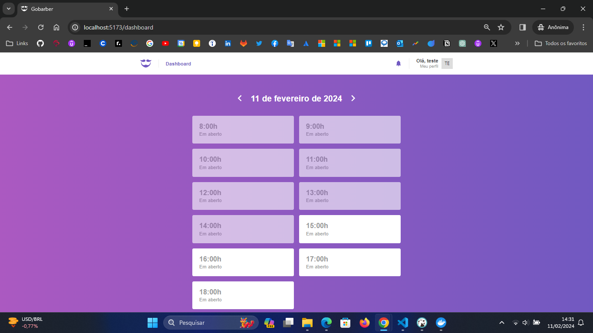

# Gobarber - Front-end

## React + Vite

### About

GoBarber is a project that is a complete application for scheduling barbershop services (an application developed with React Native and Expo for user scheduling and this application will be used to check the user's scheduled times and schedule an appointment), checking already scheduled times is possible on web version and this project is also used to modify the user profile.

Configuration to make React work on Vite with HMR and some ESLint rules.

### Screenshot





### Uses

Install packages (dependencies)

```bash

yarn

```

Run application using Vite

```bash

yarn run dev

```

Currently, two official plugins are available:

- [@vitejs/plugin-react](https://github.com/vitejs/vite-plugin-react/blob/main/packages/plugin-react/README.md) uses [Babel](https://babeljs.io/) for Fast Refresh
- [@vitejs/plugin-react-swc](https://github.com/vitejs/vite-plugin-react-swc) uses [SWC](https://swc.rs/) for Fast Refresh
